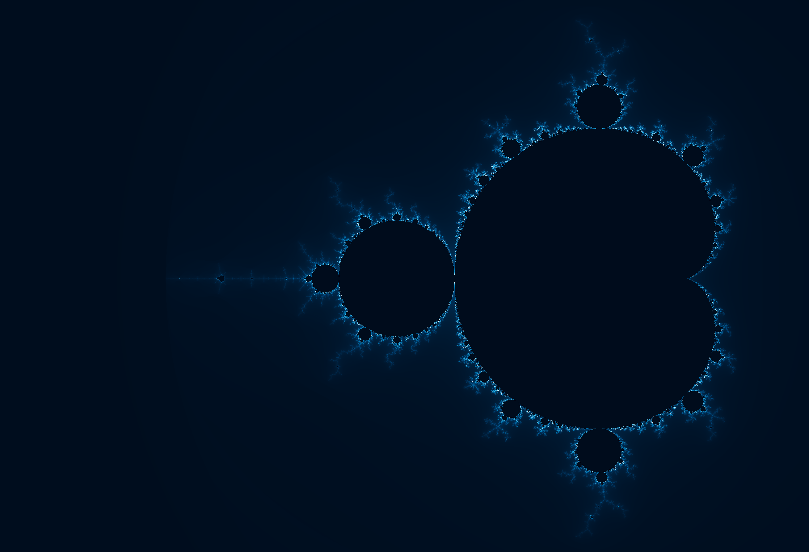
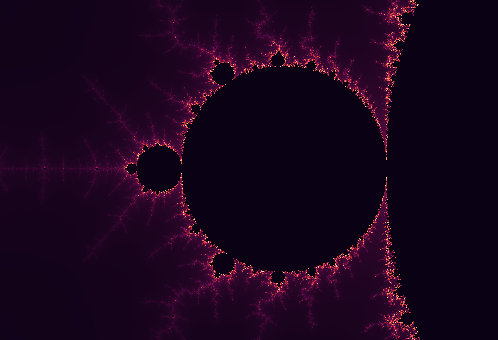
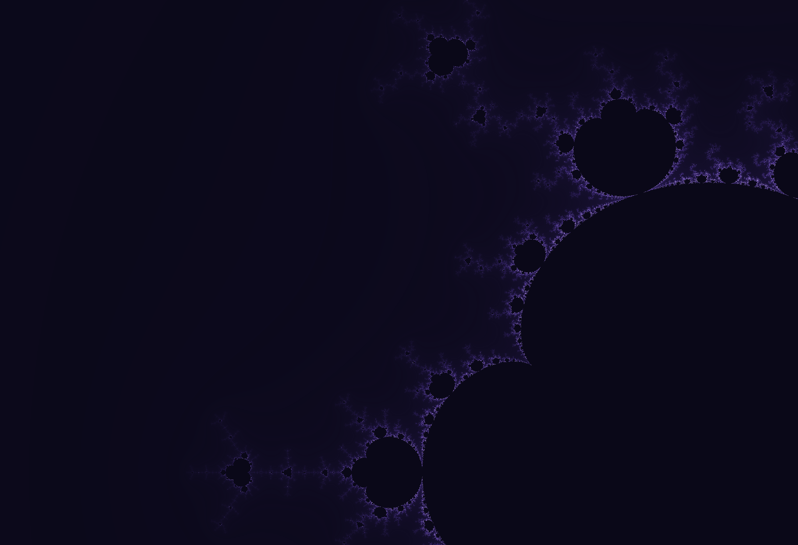

# Frax

A sleek **WebGL fractal explorer** with zoom-to-cursor, curated dark palettes, multiple fractal types, and one-click screenshots - all in a single HTML file.

## Gallery

  
  

  
  

## Features
- Zoom to cursor (mouse wheel) with adjustable **Zoom amount**
- Multiple fractals: Mandelbrot, Multibrot-3/4/5, Burning Ship, Perpendicular Burning Ship, Celtic, and **Julia** (with C controls)
- Curated palettes, including static and dynamic hue-shifting colour schemes
- Auto-zoom play/pause with speed control
- One-click Screenshots (PNG)
- Minimal, modern UI with live HUD (center, scale, iterations, FPS)
- No dependencies (vanilla JS + WebGL)

## Quick start
- Open or download `frax_v2.23.4_release.html` in a modern browser (Chrome/Edge/Firefox).  

## Controls
**Mouse**
- **Wheel:** zoom to cursor  
- **Drag:** pan

**Top bar**
- Auto zoom ▶ / ❚❚ and Speed  
- Fractal (drop-down). **Julia** shows `C = a + bi` inputs (0.1 steps)  
- Palette (colour)
- Detail (iteration bias)  
- Zoom amount (wheel sensitivity)  
- Reset · Screenshot

**Shortcuts**
- `P` play/pause auto-zoom  
- `R` reset view  
- `S` save screenshot  
- `[` / `]` previous/next palette

## Fractals
- **Mandelbrot family:** Mandelbrot, Multibrot-3, Multibrot-4, Multibrot-5  
- **Burning Ship variants:** Burning Ship, Perpendicular Burning Ship  
- **Other:** Celtic  
- **Julia:** editable `C` (Re/Im) fields; behaves differently than the others

## Palettes
Oceanic (default), InfernoLite, Aurora, Velvet, Mono, Classic, Sunset, Neon, Forest, Icefire, Magma, Twilight, Copper, Candy, Midnight, Solar, Lavender, Spectrum (cycle).

## Performance notes
- Fragment-shader escape-time with smooth coloring `(ν = n + 1 − log(log |z|)/log 2)` 
- Dynamic iteration target scales with zoom; detail slider nudges the bias  
- Device pixel ratio is clamped for performance; FPS shown in the HUD

## License
**CC0 1.0 Universal — Public Domain Dedication.**  
You can copy, modify, distribute, and use Frax, even commercially, without asking permission. See `LICENSE` for details.
